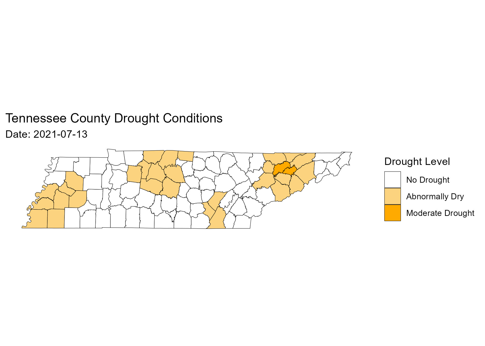
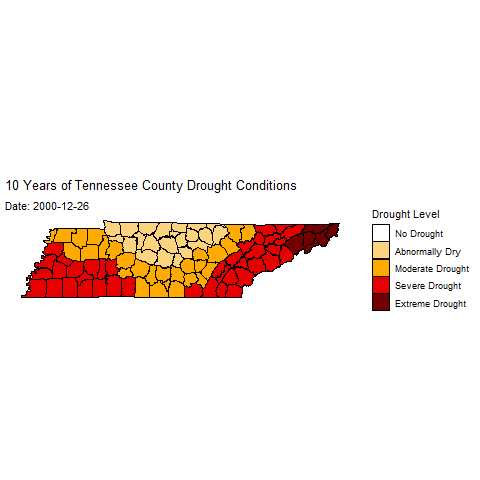

## County-Level Drought Conditions

This map shows the most sever drought condition observed across Tennessee counties on July 13, 2021.

{fig-align="center"}

## Drought Evolution Through Time

{fig-align="center"}
